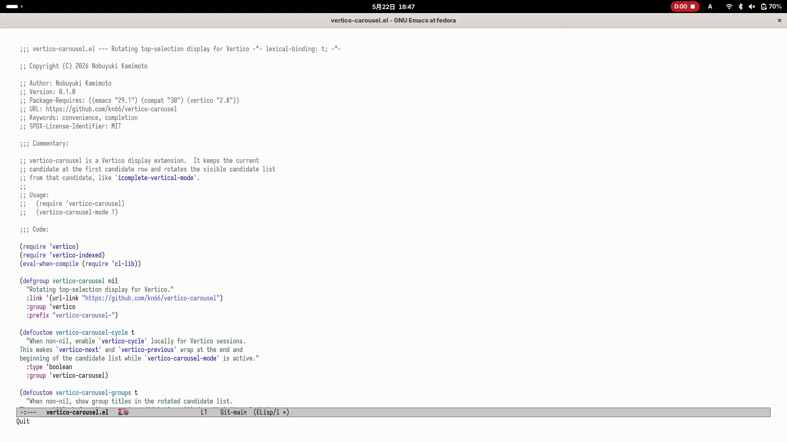

#+title: vertico-carousel

* Overview

~vertico-carousel~ is a display extension for Vertico. It always shows
the currently selected candidate on the first line of the candidate list,
then displays the following candidates below it, cycling from the end back
to the beginning.

As in ~icomplete-vertical-mode~, moving to the next candidate rotates the
entire list while the selected candidate stays in the same position.

* GIF

* Usage

Emacs 29.1 or later and Vertico 2.8 or later are required.

#+begin_src emacs-lisp
  (add-to-list 'load-path "/path/to/vertico-carousel")
  (require 'vertico-carousel)

  (vertico-mode 1)
  (vertico-carousel-mode 1)
#+end_src

By default, ~vertico-cycle~ is enabled buffer-locally only during
completion sessions. If you want to leave cycling behavior for movement
commands to your existing configuration, use the following setting.

#+begin_src emacs-lisp
  (setq vertico-carousel-cycle nil)
#+end_src

Group headings can be displayed, but to keep the selected candidate at the
top, the heading immediately before the selected candidate is not shown. If
you do not need group headings, disable them as follows.

#+begin_src emacs-lisp
  (setq vertico-carousel-groups nil)
#+end_src

* Behavior

- The selected candidate is shown on the first line of the candidate list.
- The candidate display height follows ~vertico-count~.
- Near the end of the candidate list, candidates from the beginning are
  shown in the remaining display slots.
- When there are fewer candidates than ~vertico-count~, candidates are not
  shown more than once.
- When used with ~vertico-indexed-mode~, wrapped candidates can also be
  selected by their displayed candidate numbers.

* Testing

If Vertico and compat are installed in the normal package environment, run
the tests as follows.

#+begin_src shell
  emacs -Q --batch \
        --eval "(progn (require 'package) (package-initialize))" \
        -L /path/to/vertico-carousel \
        -l test/vertico-carousel-test.el \
        -f ert-run-tests-batch-and-exit
#+end_src

When specifying local dependency package directories explicitly, include
compat in ~-L~ as well as Vertico.

#+begin_src shell
  emacs -Q --batch \
        -L /path/to/vertico-carousel \
        -L ~/.emacs.d/elpa/compat-31.0.0.1 \
        -L ~/.emacs.d/elpa/vertico-2.8 \
        -l test/vertico-carousel-test.el \
        -f ert-run-tests-batch-and-exit
#+end_src

For quality checks, use byte compilation, ~checkdoc~, and ~package-lint~ in
addition to ERT.
